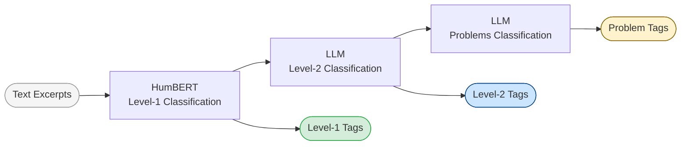
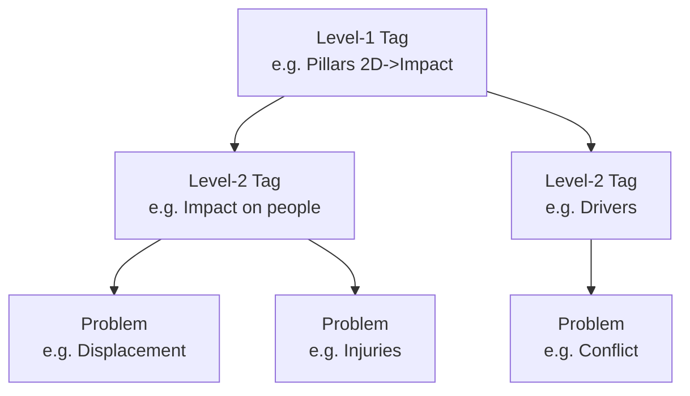

# Humanitarian Classification Framework — Inference

Inference library for classifying humanitarian text excerpts using **HumBERT** (a debiased transformer) for Level-1 tagging, and **LLM-based zero-shot classification** for Level-2 tagging and problem identification.

Models are trained on [HumSet](https://aclanthology.org/2022.findings-emnlp.321/) with debiasing techniques from [Bias Measurement and Mitigation for Humanitarian Text Classification](https://github.com/sfekih/bias-measurement-mitigation-humanitarian-text-classification).

---

## Pipeline



### Tag Hierarchy



---

## Installation

```bash
pip install .
```

Or directly from GitHub:

```bash
pip install git+https://github.com/MediaMonitoringAndAnalysis/humanitarian-extract-classificator
```

> The HumBERT model (`humbert_debiased.pt`) is **downloaded automatically** to `~/.cache/humanitarian_extract_classificator/` on first use. No manual download required.

---

## Usage

### Step 1 — Level-1 Classification (HumBERT)

```python
from humanitarian_extract_classificator import humbert_classification

excerpts = [
    "Heavy floods destroyed bridges and cut off access to three villages, "
    "leaving 2,000 people without food or medical supplies.",
    "Armed clashes forced 500 families to flee their homes overnight.",
]

level1 = humbert_classification(excerpts, prediction_ratio=1.0)
```

**Output — `List[List[str]]`, one label list per excerpt:**

| # | Excerpt (truncated) | Level-1 Tags |
|---|---|---|
| 0 | *Heavy floods destroyed bridges…* | `Pillars 1D->Shock-Event->Type and characteristics`, `Pillars 2D->Impact->Impact on systems, services and networks`, `Pillars 2D->Humanitarian Conditions->Number of people in need`, `Sectors->Food Security->Food` |
| 1 | *Armed clashes forced 500 families…* | `Pillars 1D->Shock-Event->Type and characteristics`, `Pillars 2D->Impact->Impact on people`, `Secondary Tags->Displaced->IDP` |

> **`prediction_ratio` controls the precision / recall trade-off:**
>
> | Value | Effect |
> |---|---|
> | `< 1.0` | Higher recall (more tags predicted) |
> | `= 1.0` | Maximises F1 score |
> | `> 1.0` | Higher precision (fewer, more confident tags) |

---

### Step 2 — Level-2 Classification (LLM)

Requires an OpenAI API key. Operates only on entries that already carry a Level-1 tag.

```python
import os
from humanitarian_extract_classificator import level2_classification

os.environ["OPENAI_API_KEY"] = "sk-..."

level2 = level2_classification(
    entries=excerpts,
    level1_classifications=level1,
    model="gpt-4o-mini",           # default
    prediction_ratio=1.0,
)
```

**Output — adds sub-categories under each Level-1 tag:**

| # | Level-2 Tags |
|---|---|
| 0 | `Pillars 1D->Shock-Event->Type and characteristics`, `Pillars 2D->Impact->Impact on systems, services and networks`, `Sectors->Logistics->Transport` |
| 1 | `Pillars 2D->Impact->Impact on people`, `Pillars 2D->Humanitarian Conditions->Living standards`, `Sectors->Protection->Physical safety and security` |

---

### Step 3 — Problems Classification (LLM)

Identifies specific humanitarian problems within each Level-2 category.

```python
from humanitarian_extract_classificator import level2_problems_classification

problems = level2_problems_classification(
    entries=excerpts,
    level2_classifications=level2,
    model="gpt-4o-mini",           # default
)
```

**Output — granular problem labels per entry:**

| # | Problem Tags |
|---|---|
| 0 | `Pillars 2D->Impact->Impact on systems, services and networks->Infrastructure damage`, `Pillars 2D->Humanitarian Conditions->Number of people in need->Food insecurity` |
| 1 | `Pillars 2D->Impact->Impact on people->Displacement`, `Sectors->Protection->Physical safety and security->Armed violence` |

---

### Full end-to-end script

```python
import os, json
from humanitarian_extract_classificator import (
    humbert_classification,
    level2_classification,
    level2_problems_classification,
)

os.environ["OPENAI_API_KEY"] = "sk-..."

with open("data/test_inputs/example_excerpts.json") as f:
    excerpts = json.load(f)[:10]

level1   = humbert_classification(excerpts, prediction_ratio=1.0)
level2   = level2_classification(entries=excerpts, level1_classifications=level1)
problems = level2_problems_classification(entries=excerpts, level2_classifications=level2)
```

Results are saved incrementally to `data/predictions/classification_results/`:

```
data/predictions/classification_results/
├── level2_classifications.json          # List[List[str]]
└── level2_problems_classifications.json # List[List[str]]
```

---

## Advanced — Confidence Ratios

Return raw confidence ratios instead of binary labels to implement custom thresholds:

```python
ratio_outputs = humbert_classification(
    excerpts,
    prediction_ratio=1.0,
    return_ratio=True,          # returns List[Dict[str, float]]
)

# Per-entry dict: { "tag_name": ratio, ... }
# ratio > 1.0 → above threshold (would be predicted at prediction_ratio=1.0)
top_tag = max(ratio_outputs[0], key=ratio_outputs[0].get)
```

---

## API Parameters

### `humbert_classification`

| Parameter | Type | Default | Description |
|---|---|---|---|
| `text` | `List[str]` | — | Input excerpts |
| `batch_size` | `int` | `32` | Batch size for inference |
| `prediction_ratio` | `float` | `1.0` | Decision threshold ratio |
| `model_path` | `str` | `~/.cache/…/humbert_debiased.pt` | Override model path |
| `return_ratio` | `bool` | `False` | Return confidence ratios instead of labels |

### `level2_classification` / `level2_problems_classification`

| Parameter | Type | Default | Description |
|---|---|---|---|
| `entries` | `List[str]` | — | Input excerpts |
| `level1_classifications` | `List[List[str]]` | — | Output of `humbert_classification` |
| `api_key` | `str` | `$OPENAI_API_KEY` | OpenAI API key |
| `model` | `str` | `"gpt-4o-mini"` | LLM model name |
| `pipeline` | `str` | `"OpenAI"` | API backend |
| `save_folder_path` | `PathLike` | `data/predictions/classification_results` | Output directory |
| `hf_token` | `str` | `$hf_token` | HuggingFace token for private datasets |

---

## License

AGPL v3 — any derivative works must be open-sourced under the same license.

For questions, support, or model access: `selimfek@gmail.com`
